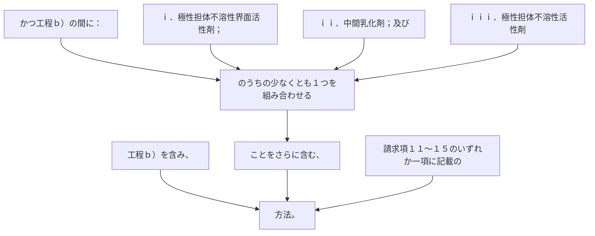

工程ｂ）を含み、かつ工程ｂ）の間に：
ｉ．  極性担体不溶性界面活性剤；
ｉｉ．  中間乳化剤；及び
ｉｉｉ．  極性担体不溶性活性剤
のうちの少なくとも１つを組み合わせることをさらに含む、
請求項１１～１５のいずれか一項に記載の方法。

```mermaid
flowchart TD
A[工程ｂ）を含み、]
B[かつ工程ｂ）の間に：]
C[ｉ．極性担体不溶性界面活性剤；]
D[ｉｉ．中間乳化剤；及び]
E[ｉｉｉ．極性担体不溶性活性剤]
F[のうちの少なくとも１つを組み合わせる]
G[ことをさらに含む、]
H[請求項１１～１５のいずれか一項に記載の]
I[方法。]

A --> I
B --> F
C --> F
D --> F
E --> F
F --> G
G --> I
H --> I
```