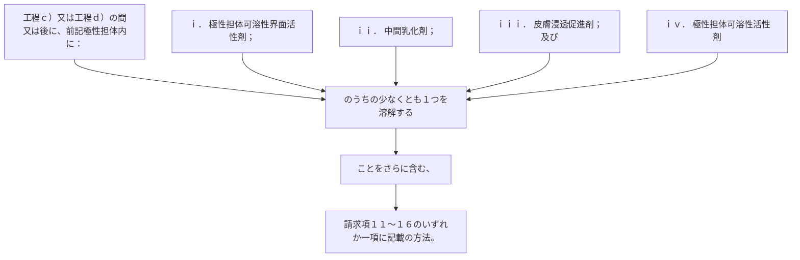

```mermaid
flowchart TD
A[工程ｃ）又は工程ｄ）の間又は後に、前記極性担体内に：]
B[ｉ． 極性担体可溶性界面活性剤；]
C[ｉｉ． 中間乳化剤；]
D[ｉｉｉ． 皮膚浸透促進剤；及び]
E[ｉｖ． 極性担体可溶性活性剤]
F[のうちの少なくとも１つを溶解する]
G[ことをさらに含む、]
H[請求項１１～１６のいずれか一項に記載の方法。]

A --> F
B --> F
C --> F
D --> F
E --> F
F --> G
G --> H
```