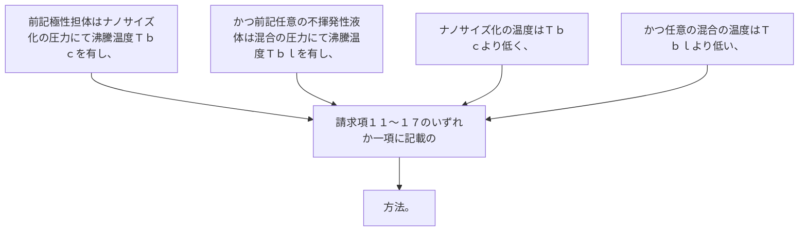

前記極性担体はナノサイズ化の圧力にて沸騰温度Ｔｂ
ｃ
を有し、かつ前記任意の不揮発性液体は混合の圧力にて沸騰温度Ｔｂ
ｌ
を有し、ナノサイズ化の温度はＴｂ
ｃ
より低く、かつ任意の混合の温度はＴｂ
ｌ
より低い、請求項１１～１７のいずれか一項に記載の方法。

```mermaid
flowchart TD
A[前記極性担体はナノサイズ化の圧力にて沸騰温度Ｔｂｃを有し、]
B[かつ前記任意の不揮発性液体は混合の圧力にて沸騰温度Ｔｂｌを有し、]
C[ナノサイズ化の温度はＴｂｃより低く、]
D[かつ任意の混合の温度はＴｂｌより低い、]
E[請求項１１～１７のいずれか一項に記載の]
F[方法。]
A --> E
B --> E
C --> E
D --> E
E --> F
```