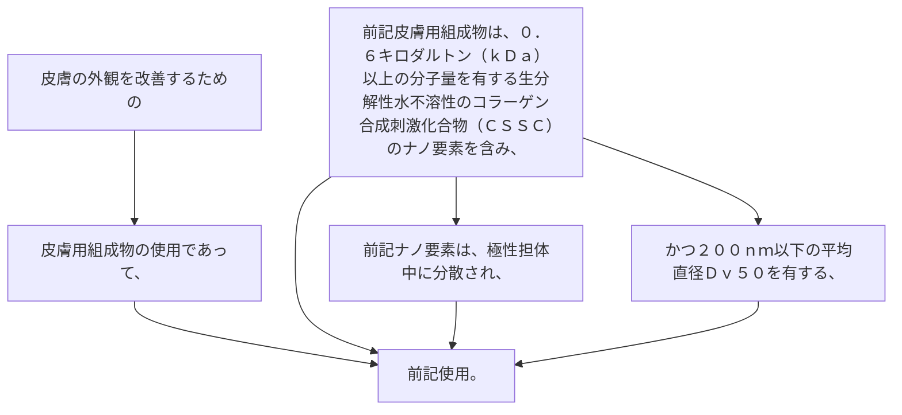

皮膚の外観を改善するための皮膚用組成物の使用であって、前記皮膚用組成物は、０．６キロダルトン（ｋＤａ）以上の分子量を有する生分解性水不溶性のコラーゲン合成刺激化合物（ＣＳＳＣ）のナノ要素を含み、前記ナノ要素は、極性担体中に分散され、かつ２００ｎｍ以下の平均直径Ｄｖ５０を有する、前記使用。

```mermaid
flowchart TD
A[皮膚の外観を改善するための]
B[皮膚用組成物の使用であって、]
C[前記皮膚用組成物は、０．６キロダルトン（ｋＤａ）以上の分子量を有する生分解性水不溶性のコラーゲン合成刺激化合物（ＣＳＳＣ）のナノ要素を含み、]
D[前記ナノ要素は、極性担体中に分散され、]
E[かつ２００ｎｍ以下の平均直径Ｄｖ５０を有する、]
F[前記使用。]
A --> B
B --> F
C --> D
C --> E
C --> F
D --> F
E --> F
```