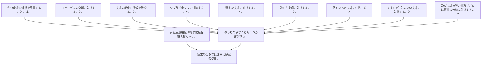

前記皮膚用組成物は化粧品組成物であり、かつ皮膚の外観を改善することには、コラーゲンの分解に対抗すること、皮膚の老化の徴候を治療すること、シワ及び小ジワに対抗すること、衰えた皮膚に対抗すること、弛んだ皮膚に対抗すること、薄くなった皮膚に対抗すること、くすんで生気のない皮膚に対抗すること、及び皮膚の弾力性及び／又は張性の欠如に対抗することのうちの少なくとも１つが含まれる、請求項１９又は２０に記載の使用。
