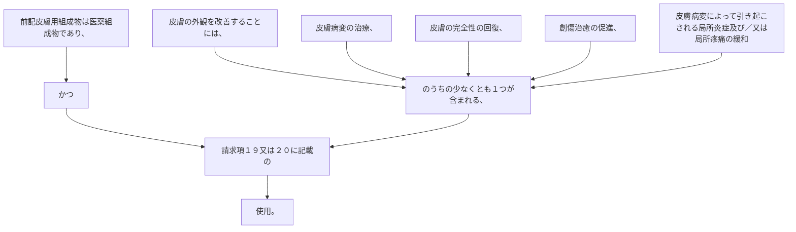

```mermaid
flowchart TD
A[前記皮膚用組成物は医薬組成物であり、]
B[かつ]
C[皮膚の外観を改善することには、]
D[皮膚病変の治療、]
E[皮膚の完全性の回復、]
F[創傷治癒の促進、]
G[皮膚病変によって引き起こされる局所炎症及び／又は局所疼痛の緩和]
H[のうちの少なくとも１つが含まれる、]
I[請求項１９又は２０に記載の]
J[使用。]

A --> B
C --> H
D --> H
E --> H
F --> H
G --> H
B --> I
H --> I
I --> J
```