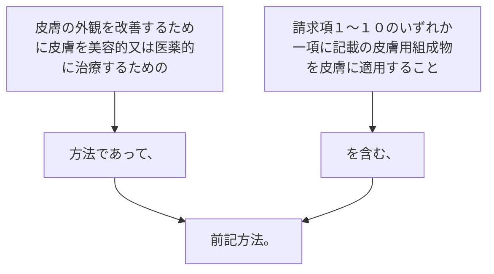

皮膚の外観を改善するために皮膚を美容的又は医薬的に治療するための方法であって、請求項１～１０のいずれか一項に記載の皮膚用組成物を皮膚に適用することを含む、前記方法。

```mermaid
flowchart TD
A[皮膚の外観を改善するために皮膚を美容的又は医薬的に治療するための]
B[方法であって、]
C[請求項１～１０のいずれか一項に記載の皮膚用組成物を皮膚に適用すること]
D[を含む、]
E[前記方法。]
A --> B
B --> E
C --> D
D --> E
```