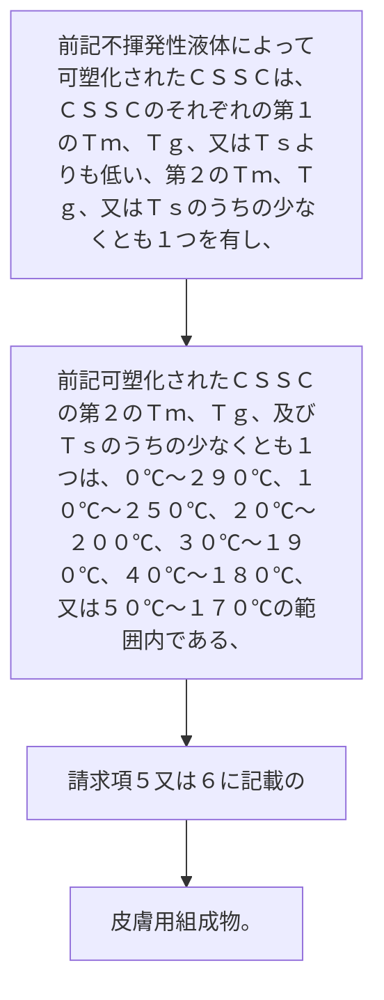

```mermaid
flowchart TD
A[前記不揮発性液体によって可塑化されたＣＳＳＣは、ＣＳＳＣのそれぞれの第１のＴｍ、Ｔｇ、又はＴｓよりも低い、第２のＴｍ、Ｔｇ、又はＴｓのうちの少なくとも１つを有し、]
B[前記可塑化されたＣＳＳＣの第２のＴｍ、Ｔｇ、及びＴｓのうちの少なくとも１つは、０℃～２９０℃、１０℃～２５０℃、２０℃～２００℃、３０℃～１９０℃、４０℃～１８０℃、又は５０℃～１７０℃の範囲内である、]
C[請求項５又は６に記載の]
D[皮膚用組成物。]
A --> B
B --> C
C --> D
```