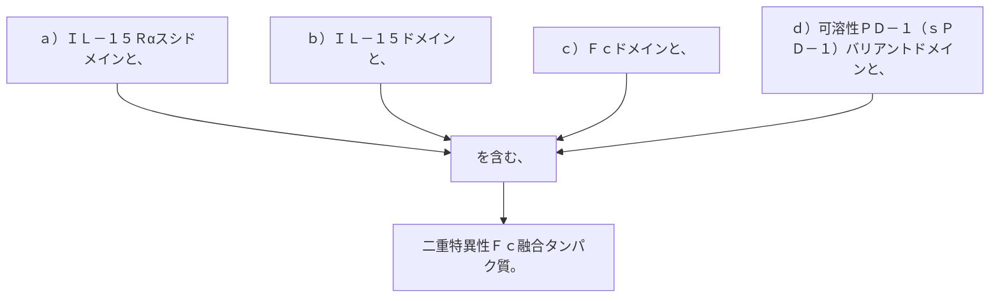

ａ）ＩＬ－１５Ｒαスシドメインと、
ｂ）ＩＬ－１５ドメインと、
ｃ）Ｆｃドメインと、
ｄ）可溶性ＰＤ－１（ｓＰＤ－１）バリアントドメインと、を含む、二重特異性Ｆｃ融合タンパク質。

```mermaid
flowchart TD
A[ａ）ＩＬ－１５Ｒαスシドメインと、]
B[ｂ）ＩＬ－１５ドメインと、]
C[ｃ）Ｆｃドメインと、]
D[ｄ）可溶性ＰＤ－１（ｓＰＤ－１）バリアントドメインと、]
E[を含む、]
F[二重特異性Ｆｃ融合タンパク質。]
A --> E
B --> E
C --> E
D --> E
E --> F
```