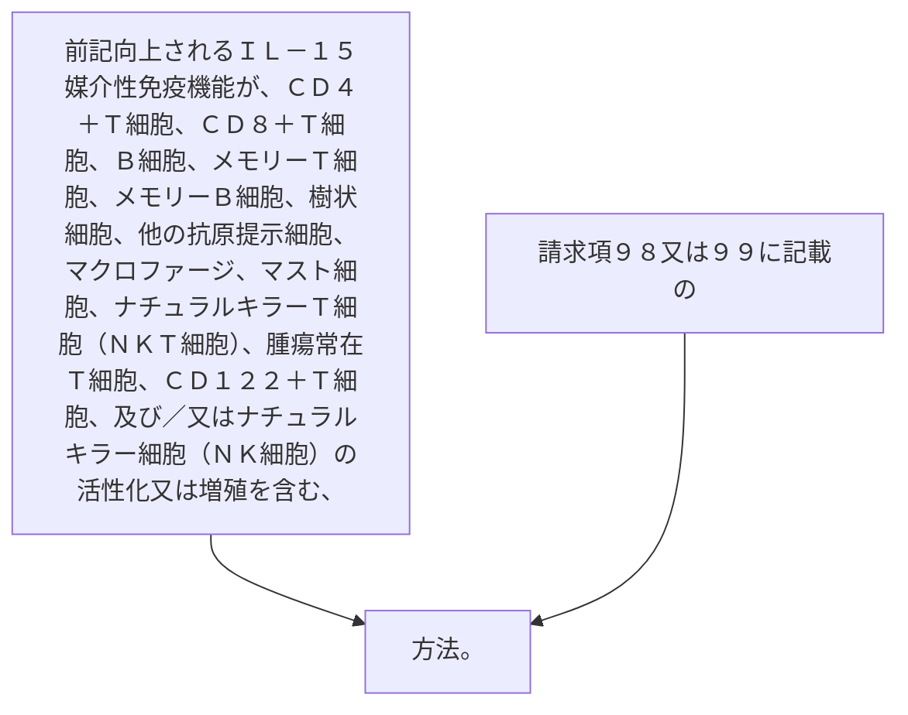

前記向上されるＩＬ－１５媒介性免疫機能が、ＣＤ４＋Ｔ細胞、ＣＤ８＋Ｔ細胞、Ｂ細胞、メモリーＴ細胞、メモリーＢ細胞、樹状細胞、他の抗原提示細胞、マクロファージ、マスト細胞、ナチュラルキラーＴ細胞（ＮＫＴ細胞）、腫瘍常在Ｔ細胞、ＣＤ１２２＋Ｔ細胞、及び／又はナチュラルキラー細胞（ＮＫ細胞）の活性化又は増殖を含む、請求項９８又は９９に記載の方法。

```mermaid
flowchart TD
A[前記向上されるＩＬ－１５媒介性免疫機能が、ＣＤ４＋Ｔ細胞、ＣＤ８＋Ｔ細胞、Ｂ細胞、メモリーＴ細胞、メモリーＢ細胞、樹状細胞、他の抗原提示細胞、マクロファージ、マスト細胞、ナチュラルキラーＴ細胞（ＮＫＴ細胞）、腫瘍常在Ｔ細胞、ＣＤ１２２＋Ｔ細胞、及び／又はナチュラルキラー細胞（ＮＫ細胞）の活性化又は増殖を含む、]
B[請求項９８又は９９に記載の]
C[方法。]
A --> C
B --> C
```