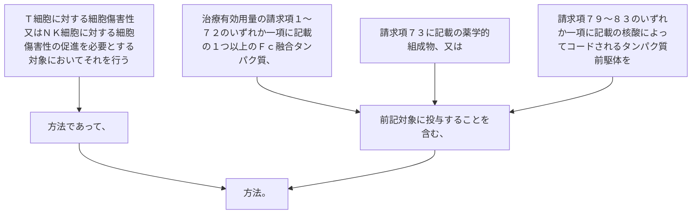

```mermaid
flowchart TD
A[Ｔ細胞に対する細胞傷害性又はＮＫ細胞に対する細胞傷害性の促進を必要とする対象においてそれを行う]
B[方法であって、]
C[治療有効用量の請求項１～７２のいずれか一項に記載の１つ以上のＦｃ融合タンパク質、]
D[請求項７３に記載の薬学的組成物、又は]
E[請求項７９～８３のいずれか一項に記載の核酸によってコードされるタンパク質前駆体を]
F[前記対象に投与することを含む、]
G[方法。]
A --> B
B --> G
C --> F
D --> F
E --> F
F --> G
```