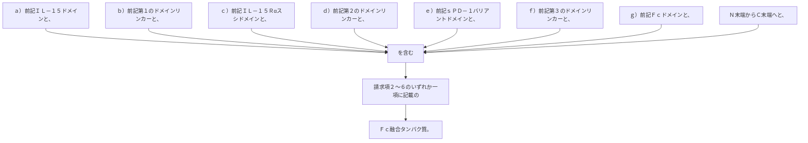

```mermaid
flowchart TD
A[Ｎ末端からＣ末端へと、]
B[ａ）前記ＩＬ－１５ドメインと、]
C[ｂ）前記第１のドメインリンカーと、]
D[ｃ）前記ＩＬ－１５Ｒαスシドメインと、]
E[ｄ）前記第２のドメインリンカーと、]
F[ｅ）前記ｓＰＤ－１バリアントドメインと、]
G[ｆ）前記第３のドメインリンカーと、]
H[ｇ）前記Ｆｃドメインと、]
I[を含む]
J[請求項２～６のいずれか一項に記載の]
K[Ｆｃ融合タンパク質。]

B --> I
C --> I
D --> I
E --> I
F --> I
G --> I
H --> I
A --> I
I --> J
J --> K
```