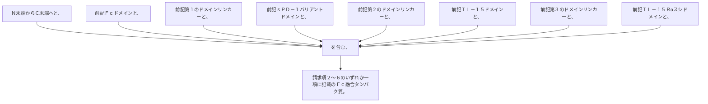

```mermaid
flowchart TD
A[Ｎ末端からＣ末端へと、]
B[前記Ｆｃドメインと、]
C[前記第１のドメインリンカーと、]
D[前記ｓＰＤ－１バリアントドメインと、]
E[前記第２のドメインリンカーと、]
F[前記ＩＬ－１５ドメインと、]
G[前記第３のドメインリンカーと、]
H[前記ＩＬ－１５Ｒαスシドメインと、]
I[を含む、]
J[請求項２～６のいずれか一項に記載のＦｃ融合タンパク質。]
A --> I
B --> I
C --> I
D --> I
E --> I
F --> I
G --> I
H --> I
I --> J
```