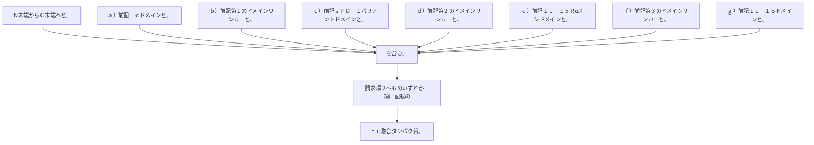

Ｎ末端からＣ末端へと、
ａ）前記Ｆｃドメインと、
ｂ）前記第１のドメインリンカーと、
ｃ）前記ｓＰＤ－１バリアントドメインと、
ｄ）前記第２のドメインリンカーと、
ｅ）前記ＩＬ－１５Ｒαスシドメインと、
ｆ）前記第３のドメインリンカーと、
ｇ）前記ＩＬ－１５ドメインと、を含む、請求項２～６のいずれか一項に記載のＦｃ融合タンパク質。

```mermaid
flowchart TD
A[Ｎ末端からＣ末端へと、]
B[ａ）前記Ｆｃドメインと、]
C[ｂ）前記第１のドメインリンカーと、]
D[ｃ）前記ｓＰＤ－１バリアントドメインと、]
E[ｄ）前記第２のドメインリンカーと、]
F[ｅ）前記ＩＬ－１５Ｒαスシドメインと、]
G[ｆ）前記第３のドメインリンカーと、]
H[ｇ）前記ＩＬ－１５ドメインと、]
I[を含む、]
J[請求項２～６のいずれか一項に記載の]
K[Ｆｃ融合タンパク質。]
A --> I
B --> I
C --> I
D --> I
E --> I
F --> I
G --> I
H --> I
I --> J
J --> K
```