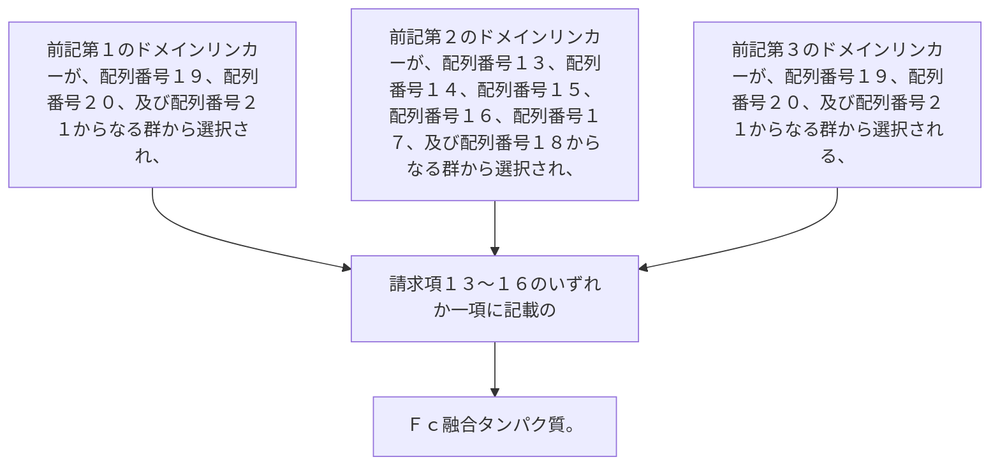

前記第１のドメインリンカーが、配列番号１９、配列番号２０、及び配列番号２１からなる群から選択され、
前記第２のドメインリンカーが、配列番号１３、配列番号１４、配列番号１５、配列番号１６、配列番号１７、及び配列番号１８からなる群から選択され、
前記第３のドメインリンカーが、配列番号１９、配列番号２０、及び配列番号２１からなる群から選択される、請求項１３～１６のいずれか一項に記載のＦｃ融合タンパク質。
