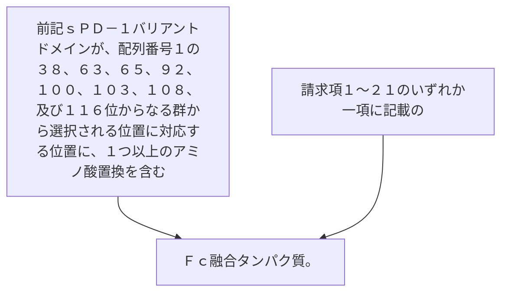

前記ｓＰＤ－１バリアントドメインが、配列番号１の３８、６３、６５、９２、１００、１０３、１０８、及び１１６位からなる群から選択される位置に対応する位置に、１つ以上のアミノ酸置換を含む、請求項１～２１のいずれか一項に記載のＦｃ融合タンパク質。

```mermaid
flowchart TD
A[前記ｓＰＤ－１バリアントドメインが、配列番号１の３８、６３、６５、９２、１００、１０３、１０８、及び１１６位からなる群から選択される位置に対応する位置に、１つ以上のアミノ酸置換を含む]
B[請求項１～２１のいずれか一項に記載の]
C[Ｆｃ融合タンパク質。]
A --> C
B --> C
```