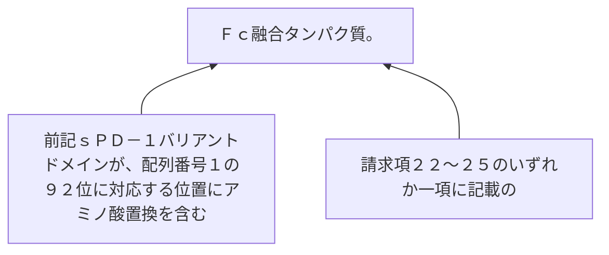

前記ｓＰＤ－１バリアントドメインが、配列番号１の９２位に対応する位置にアミノ酸置換を含む、請求項２２～２５のいずれか一項に記載のＦｃ融合タンパク質。

```mermaid
flowchart BT
C[Ｆｃ融合タンパク質。]
A[前記ｓＰＤ－１バリアントドメインが、配列番号１の９２位に対応する位置にアミノ酸置換を含む]
B[請求項２２～２５のいずれか一項に記載の]
A --> C
B --> C
```