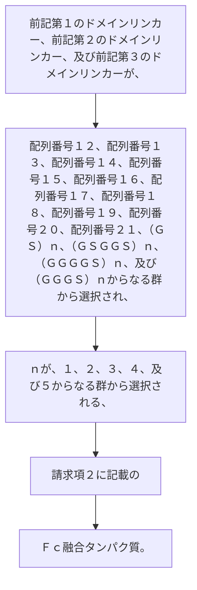

```mermaid
flowchart TD
A[前記第１のドメインリンカー、前記第２のドメインリンカー、及び前記第３のドメインリンカーが、]
B[配列番号１２、配列番号１３、配列番号１４、配列番号１５、配列番号１６、配列番号１７、配列番号１８、配列番号１９、配列番号２０、配列番号２１、（ＧＳ）ｎ、（ＧＳＧＧＳ）ｎ、（ＧＧＧＧＳ）ｎ、及び（ＧＧＧＳ）ｎからなる群から選択され、]
C[ｎが、１、２、３、４、及び５からなる群から選択される、]
D[請求項２に記載の]
E[Ｆｃ融合タンパク質。]
A --> B
B --> C
C --> D
D --> E
```