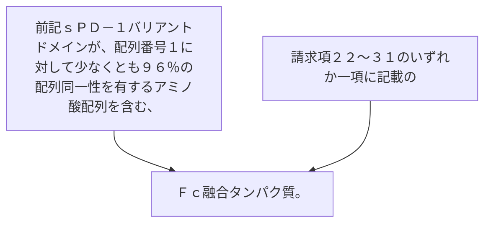

前記ｓＰＤ－１バリアントドメインが、配列番号１に対して少なくとも９６％の配列同一性を有するアミノ酸配列を含む、請求項２２～３１のいずれか一項に記載のＦｃ融合タンパク質。

```mermaid
flowchart TD
A[前記ｓＰＤ－１バリアントドメインが、配列番号１に対して少なくとも９６％の配列同一性を有するアミノ酸配列を含む、]
B[請求項２２～３１のいずれか一項に記載の]
C[Ｆｃ融合タンパク質。]
A --> C
B --> C
```