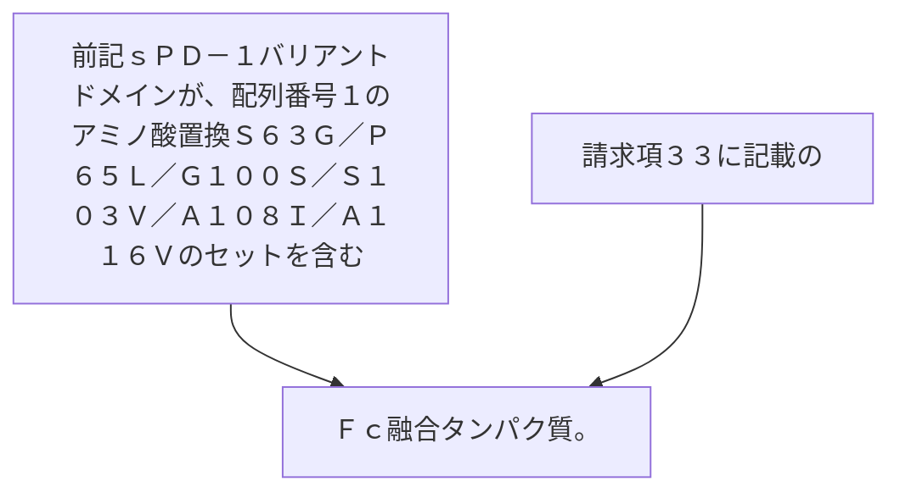

前記ｓＰＤ－１バリアントドメインが、配列番号１のアミノ酸置換Ｓ６３Ｇ／Ｐ６５Ｌ／Ｇ１００Ｓ／Ｓ１０３Ｖ／Ａ１０８Ｉ／Ａ１１６Ｖのセットを含む、請求項３３に記載のＦｃ融合タンパク質。

```mermaid
flowchart TD
A[前記ｓＰＤ－１バリアントドメインが、配列番号１のアミノ酸置換Ｓ６３Ｇ／Ｐ６５Ｌ／Ｇ１００Ｓ／Ｓ１０３Ｖ／Ａ１０８Ｉ／Ａ１１６Ｖのセットを含む]
B[請求項３３に記載の]
C[Ｆｃ融合タンパク質。]
A --> C
B --> C
```