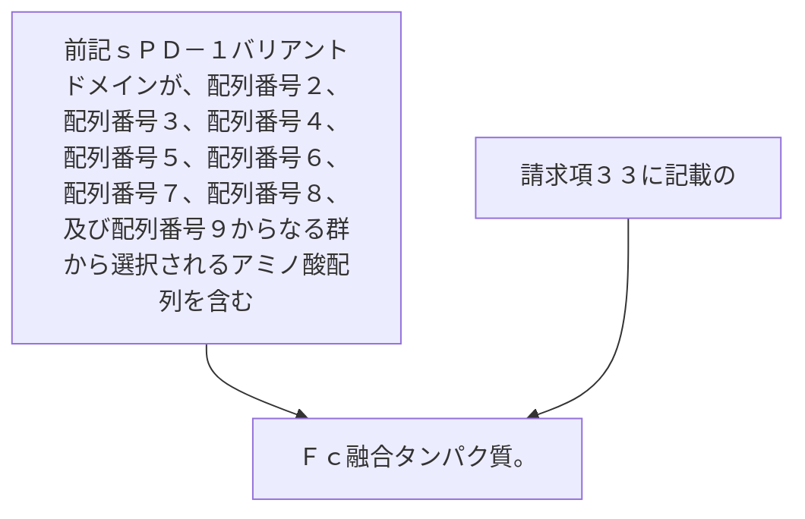

前記ｓＰＤ－１バリアントドメインが、配列番号２、配列番号３、配列番号４、配列番号５、配列番号６、配列番号７、配列番号８、及び配列番号９からなる群から選択されるアミノ酸配列を含む、請求項３３に記載のＦｃ融合タンパク質。

```mermaid
flowchart TD
A[前記ｓＰＤ－１バリアントドメインが、配列番号２、配列番号３、配列番号４、配列番号５、配列番号６、配列番号７、配列番号８、及び配列番号９からなる群から選択されるアミノ酸配列を含む]
B[請求項３３に記載の]
C[Ｆｃ融合タンパク質。]
A --> C
B --> C
```