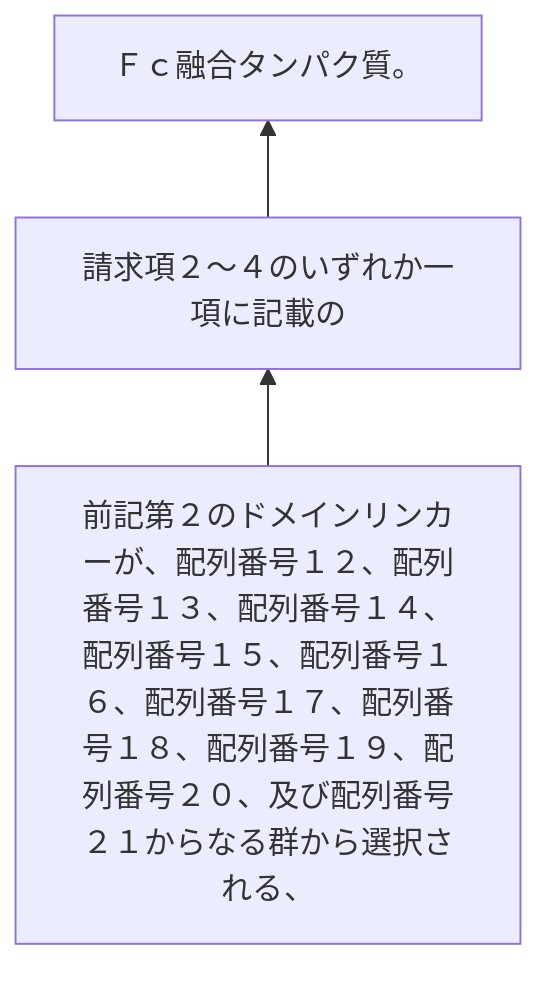

前記第２のドメインリンカーが、配列番号１２、配列番号１３、配列番号１４、配列番号１５、配列番号１６、配列番号１７、配列番号１８、配列番号１９、配列番号２０、及び配列番号２１からなる群から選択される、請求項２～４のいずれか一項に記載のＦｃ融合タンパク質。

```mermaid
flowchart BT
A[前記第２のドメインリンカーが、配列番号１２、配列番号１３、配列番号１４、配列番号１５、配列番号１６、配列番号１７、配列番号１８、配列番号１９、配列番号２０、及び配列番号２１からなる群から選択される、]
B[請求項２～４のいずれか一項に記載の]
C[Ｆｃ融合タンパク質。]
A --> B
B --> C
```