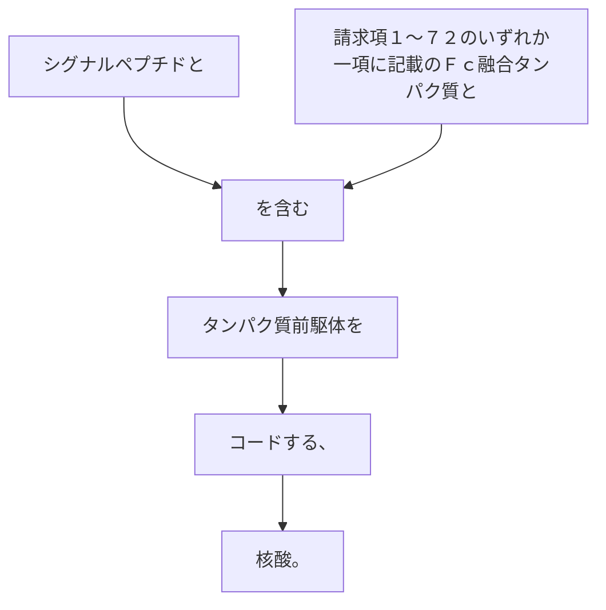

シグナルペプチドと請求項１～７２のいずれか一項に記載のＦｃ融合タンパク質とを含むタンパク質前駆体をコードする、核酸。

```mermaid
flowchart TD
A[シグナルペプチドと]
B[請求項１～７２のいずれか一項に記載のＦｃ融合タンパク質と]
C[を含む]
D[タンパク質前駆体を]
E[コードする、]
F[核酸。]
A --> C
B --> C
C --> D
D --> E
E --> F
```