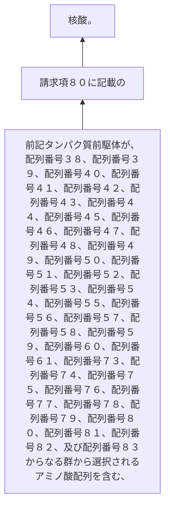

```mermaid
flowchart BT
C[核酸。]
B[請求項８０に記載の]
A[前記タンパク質前駆体が、配列番号３８、配列番号３９、配列番号４０、配列番号４１、配列番号４２、配列番号４３、配列番号４４、配列番号４５、配列番号４６、配列番号４７、配列番号４８、配列番号４９、配列番号５０、配列番号５１、配列番号５２、配列番号５３、配列番号５４、配列番号５５、配列番号５６、配列番号５７、配列番号５８、配列番号５９、配列番号６０、配列番号６１、配列番号７３、配列番号７４、配列番号７５、配列番号７６、配列番号７７、配列番号７８、配列番号７９、配列番号８０、配列番号８１、配列番号８２、及び配列番号８３からなる群から選択されるアミノ酸配列を含む、]
A --> B
B --> C
```