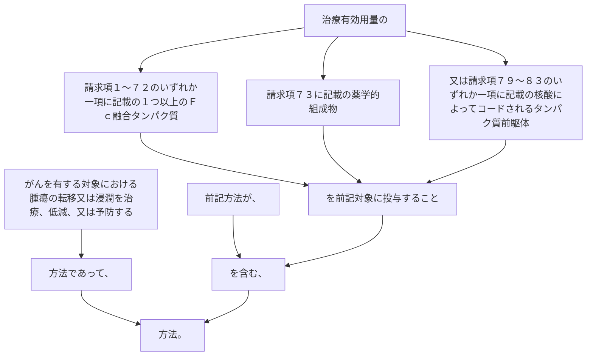

がんを有する対象における腫瘍の転移又は浸潤を治療、低減、又は予防する方法であって、前記方法が、治療有効用量の請求項１～７２のいずれか一項に記載の１つ以上のＦｃ融合タンパク質、請求項７３に記載の薬学的組成物、又は請求項７９～８３のいずれか一項に記載の核酸によってコードされるタンパク質前駆体を前記対象に投与することを含む、方法。

```mermaid
flowchart TD
A[がんを有する対象における腫瘍の転移又は浸潤を治療、低減、又は予防する]
B[方法であって、]
C[前記方法が、]
D[治療有効用量の]
E1[請求項１～７２のいずれか一項に記載の１つ以上のＦｃ融合タンパク質]
E2[請求項７３に記載の薬学的組成物]
E3[又は請求項７９～８３のいずれか一項に記載の核酸によってコードされるタンパク質前駆体]
F[を前記対象に投与すること]
G[を含む、]
H[方法。]

A --> B
B --> H
C --> G
D --> E1
D --> E2
D --> E3
E1 --> F
E2 --> F
E3 --> F
F --> G
G --> H
```