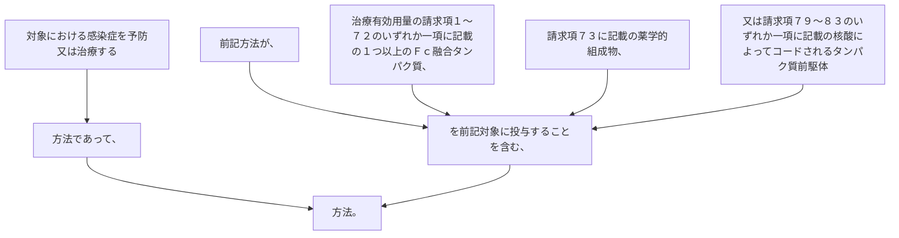

対象における感染症を予防又は治療する方法であって、前記方法が、治療有効用量の請求項１～７２のいずれか一項に記載の１つ以上のＦｃ融合タンパク質、請求項７３に記載の薬学的組成物、又は請求項７９～８３のいずれか一項に記載の核酸によってコードされるタンパク質前駆体を前記対象に投与することを含む、方法。

```mermaid
flowchart TD
A[対象における感染症を予防又は治療する]
B[方法であって、]
C[前記方法が、]
D[治療有効用量の請求項１～７２のいずれか一項に記載の１つ以上のＦｃ融合タンパク質、]
E[請求項７３に記載の薬学的組成物、]
F[又は請求項７９～８３のいずれか一項に記載の核酸によってコードされるタンパク質前駆体]
G[を前記対象に投与することを含む、]
H[方法。]

A --> B
B --> H
C --> G
D --> G
E --> G
F --> G
G --> H
```