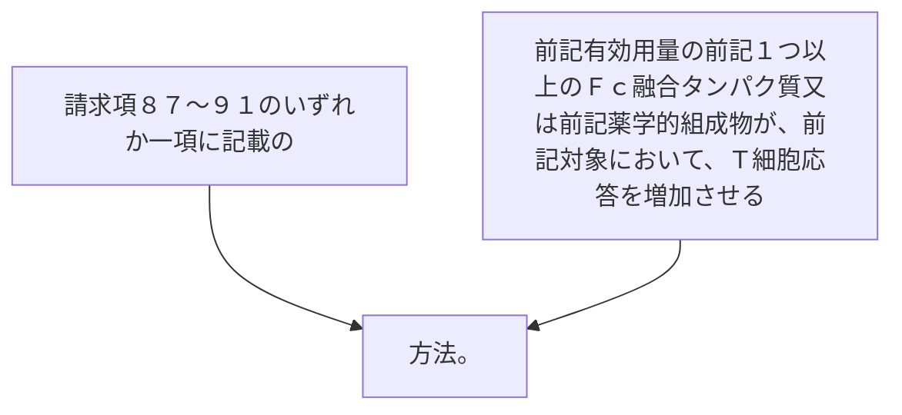

前記有効用量の前記１つ以上のＦｃ融合タンパク質又は前記薬学的組成物が、前記対象において、Ｔ細胞応答を増加させる、請求項８７～９１のいずれか一項に記載の方法。

```mermaid
flowchart TD
A[前記有効用量の前記１つ以上のＦｃ融合タンパク質又は前記薬学的組成物が、前記対象において、Ｔ細胞応答を増加させる]
B[請求項８７～９１のいずれか一項に記載の]
C[方法。]
B --> C
A --> C
```