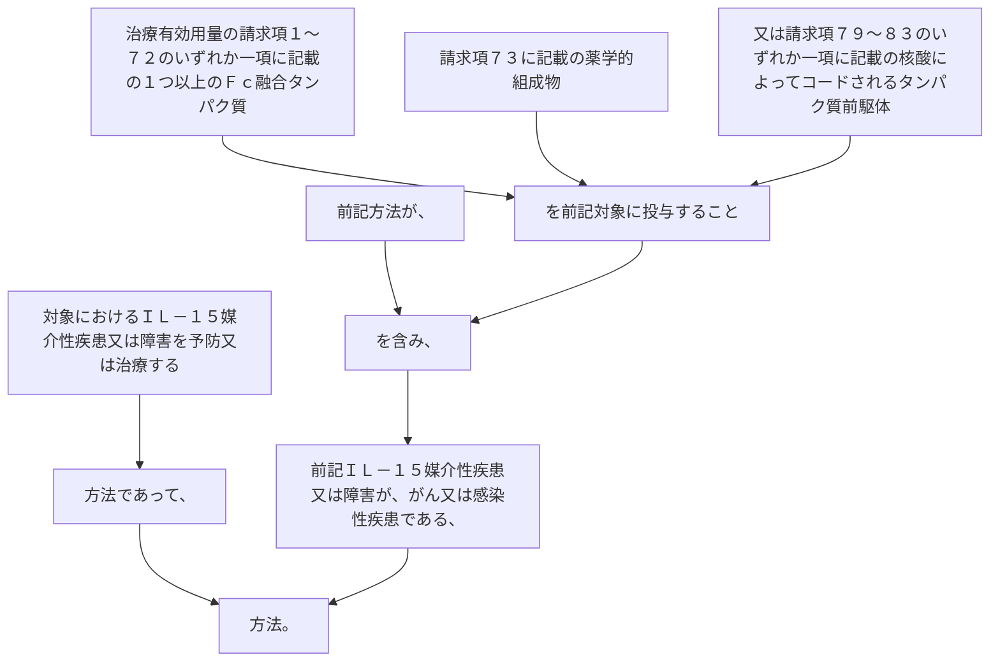

対象におけるＩＬ－１５媒介性疾患又は障害を予防又は治療する方法であって、前記方法が、治療有効用量の請求項１～７２のいずれか一項に記載の１つ以上のＦｃ融合タンパク質、請求項７３に記載の薬学的組成物、又は請求項７９～８３のいずれか一項に記載の核酸によってコードされるタンパク質前駆体を前記対象に投与することを含み、前記ＩＬ－１５媒介性疾患又は障害が、がん又は感染性疾患である、方法。

```mermaid
flowchart TD
A[対象におけるＩＬ－１５媒介性疾患又は障害を予防又は治療する]
B[方法であって、]
C[前記方法が、]
D1[治療有効用量の請求項１～７２のいずれか一項に記載の１つ以上のＦｃ融合タンパク質]
D2[請求項７３に記載の薬学的組成物]
D3[又は請求項７９～８３のいずれか一項に記載の核酸によってコードされるタンパク質前駆体]
E[を前記対象に投与すること]
F[を含み、]
G[前記ＩＬ－１５媒介性疾患又は障害が、がん又は感染性疾患である、]
H[方法。]

A --> B
B --> H
C --> F
D1 --> E
D2 --> E
D3 --> E
E --> F
F --> G
G --> H
```