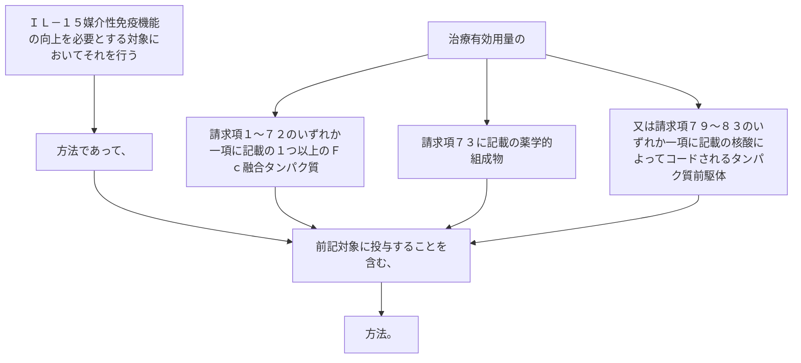

ＩＬ－１５媒介性免疫機能の向上を必要とする対象においてそれを行う方法であって、治療有効用量の請求項１～７２のいずれか一項に記載の１つ以上のＦｃ融合タンパク質、請求項７３に記載の薬学的組成物、又は請求項７９～８３のいずれか一項に記載の核酸によってコードされるタンパク質前駆体を前記対象に投与することを含む、方法。

```mermaid
flowchart TD
A[ＩＬ－１５媒介性免疫機能の向上を必要とする対象においてそれを行う]
B[方法であって、]
C[治療有効用量の]
D1[請求項１～７２のいずれか一項に記載の１つ以上のＦｃ融合タンパク質]
D2[請求項７３に記載の薬学的組成物]
D3[又は請求項７９～８３のいずれか一項に記載の核酸によってコードされるタンパク質前駆体]
E[前記対象に投与することを含む、]
F[方法。]

A --> B
B --> E
C --> D1
C --> D2
C --> D3
D1 --> E
D2 --> E
D3 --> E
E --> F
```