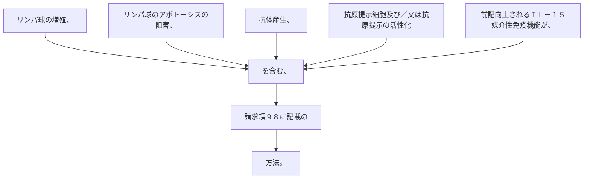

```mermaid
flowchart TD
A[前記向上されるＩＬ－１５媒介性免疫機能が、]
B[リンパ球の増殖、]
C[リンパ球のアポトーシスの阻害、]
D[抗体産生、]
E[抗原提示細胞及び／又は抗原提示の活性化]
F[を含む、]
G[請求項９８に記載の]
H[方法。]
B --> F
C --> F
D --> F
E --> F
A --> F
F --> G
G --> H
```