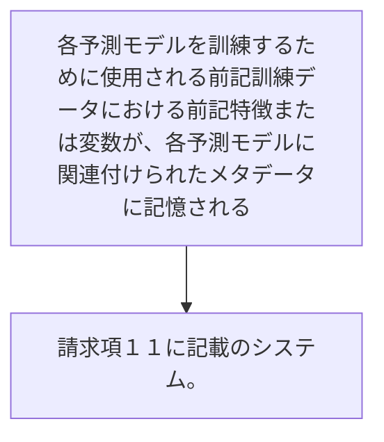

各予測モデルを訓練するために使用される前記訓練データにおける前記特徴または変数が、各予測モデルに関連付けられたメタデータに記憶される、請求項１１に記載のシステム。

```mermaid
flowchart TD
A[各予測モデルを訓練するために使用される前記訓練データにおける前記特徴または変数が、各予測モデルに関連付けられたメタデータに記憶される]
B[請求項１１に記載のシステム。]
A --> B
```