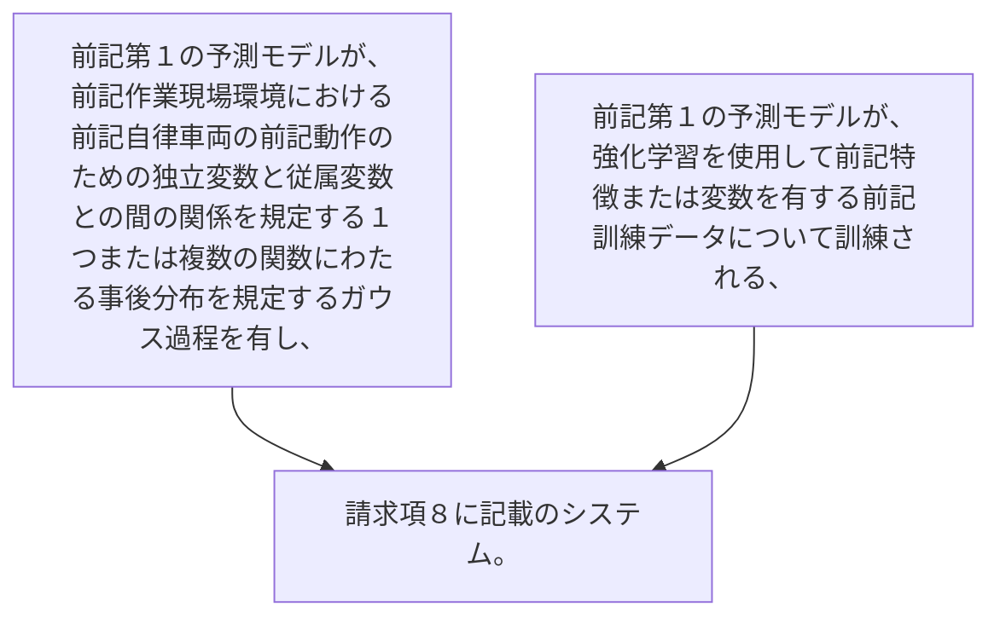

前記第１の予測モデルが、前記作業現場環境における前記自律車両の前記動作のための独立変数と従属変数との間の関係を規定する１つまたは複数の関数にわたる事後分布を規定するガウス過程を有し、前記第１の予測モデルが、強化学習を使用して前記特徴または変数を有する前記訓練データについて訓練される、請求項８に記載のシステム。

```mermaid
flowchart TD
A[前記第１の予測モデルが、前記作業現場環境における前記自律車両の前記動作のための独立変数と従属変数との間の関係を規定する１つまたは複数の関数にわたる事後分布を規定するガウス過程を有し、]
B[前記第１の予測モデルが、強化学習を使用して前記特徴または変数を有する前記訓練データについて訓練される、]
C[請求項８に記載のシステム。]
A --> C
B --> C
```