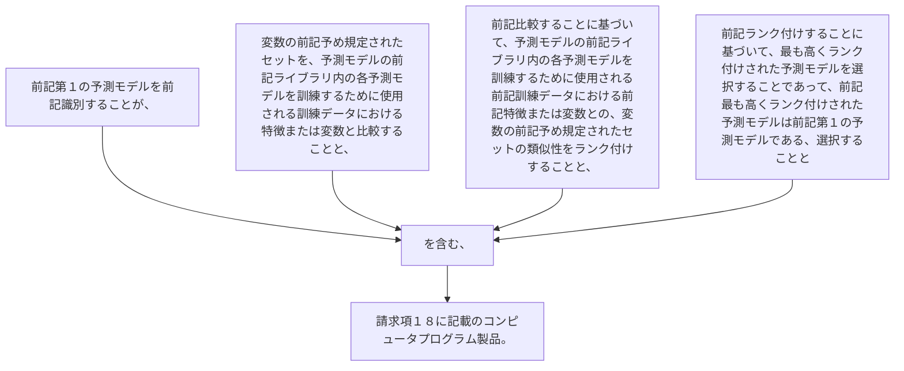

前記第１の予測モデルを前記識別することが、
変数の前記予め規定されたセットを、予測モデルの前記ライブラリ内の各予測モデルを訓練するために使用される訓練データにおける特徴または変数と比較することと、
前記比較することに基づいて、予測モデルの前記ライブラリ内の各予測モデルを訓練するために使用される前記訓練データにおける前記特徴または変数との、変数の前記予め規定されたセットの類似性をランク付けすることと、
前記ランク付けすることに基づいて、最も高くランク付けされた予測モデルを選択することであって、前記最も高くランク付けされた予測モデルは前記第１の予測モデルである、選択することと
を含む、請求項１８に記載のコンピュータプログラム製品。
