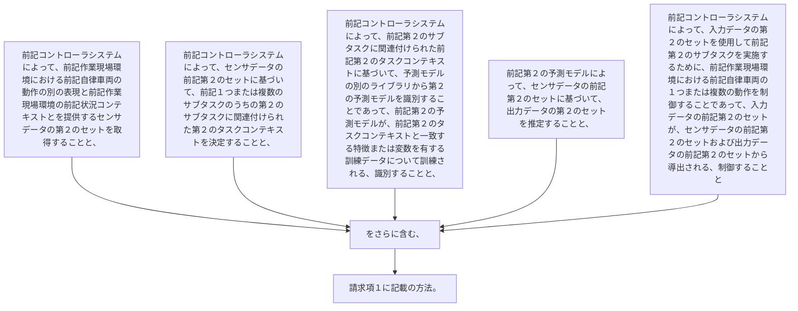

前記コントローラシステムによって、前記作業現場環境における前記自律車両の動作の別の表現と前記作業現場環境の前記状況コンテキストとを提供するセンサデータの第２のセットを取得することと、
前記コントローラシステムによって、センサデータの前記第２のセットに基づいて、前記１つまたは複数のサブタスクのうちの第２のサブタスクに関連付けられた第２のタスクコンテキストを決定することと、
前記コントローラシステムによって、前記第２のサブタスクに関連付けられた前記第２のタスクコンテキストに基づいて、予測モデルの別のライブラリから第２の予測モデルを識別することであって、前記第２の予測モデルが、前記第２のタスクコンテキストと一致する特徴または変数を有する訓練データについて訓練される、識別することと、
前記第２の予測モデルによって、センサデータの前記第２のセットに基づいて、出力データの第２のセットを推定することと、
前記コントローラシステムによって、入力データの第２のセットを使用して前記第２のサブタスクを実施するために、前記作業現場環境における前記自律車両の１つまたは複数の動作を制御することであって、入力データの前記第２のセットが、センサデータの前記第２のセットおよび出力データの前記第２のセットから導出される、制御することと
をさらに含む、請求項１に記載の方法。
