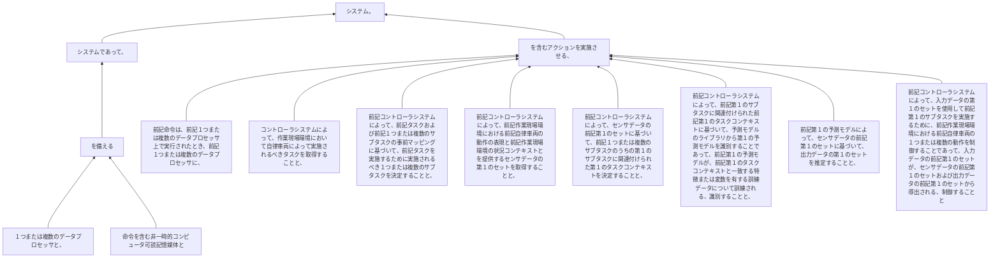

```mermaid
flowchart BT
M1[１つまたは複数のデータプロセッサと、]
M2[命令を含む非一時的コンピュータ可読記憶媒体と]
M3[を備える]
M4[システムであって、]
M5[前記命令は、前記１つまたは複数のデータプロセッサ上で実行されたとき、前記１つまたは複数のデータプロセッサに、]
A1[コントローラシステムによって、作業現場環境において自律車両によって実施されるべきタスクを取得することと、]
A2[前記コントローラシステムによって、前記タスクおよび前記１つまたは複数のサブタスクの事前マッピングに基づいて、前記タスクを実施するために実施されるべき１つまたは複数のサブタスクを決定することと、]
A3[前記コントローラシステムによって、前記作業現場環境における前記自律車両の動作の表現と前記作業現場環境の状況コンテキストとを提供するセンサデータの第１のセットを取得することと、]
A4[前記コントローラシステムによって、センサデータの前記第１のセットに基づいて、前記１つまたは複数のサブタスクのうちの第１のサブタスクに関連付けられた第１のタスクコンテキストを決定することと、]
A5[前記コントローラシステムによって、前記第１のサブタスクに関連付けられた前記第１のタスクコンテキストに基づいて、予測モデルのライブラリから第１の予測モデルを識別することであって、前記第１の予測モデルが、前記第１のタスクコンテキストと一致する特徴または変数を有する訓練データについて訓練される、識別することと、]
A6[前記第１の予測モデルによって、センサデータの前記第１のセットに基づいて、出力データの第１のセットを推定することと、]
A7[前記コントローラシステムによって、入力データの第１のセットを使用して前記第１のサブタスクを実施するために、前記作業現場環境における前記自律車両の１つまたは複数の動作を制御することであって、入力データの前記第１のセットが、センサデータの前記第１のセットおよび出力データの前記第１のセットから導出される、制御することと]
M6[を含むアクションを実施させる、]
M7[システム。]

M1 --> M3
M2 --> M3
M3 --> M4
M4 --> M7
M5 --> M6
A1 --> M6
A2 --> M6
A3 --> M6
A4 --> M6
A5 --> M6
A6 --> M6
A7 --> M6
M6 --> M7
```