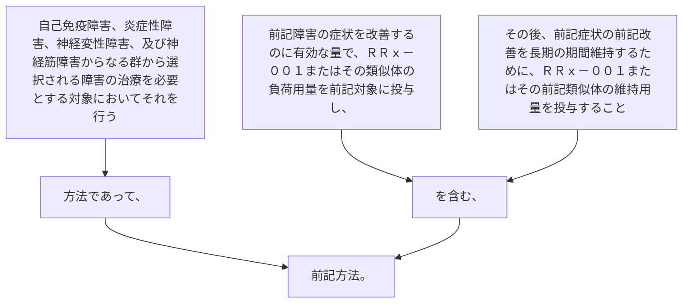

```mermaid
flowchart TD
A[自己免疫障害、炎症性障害、神経変性障害、及び神経筋障害からなる群から選択される障害の治療を必要とする対象においてそれを行う]
B[方法であって、]
C[前記障害の症状を改善するのに有効な量で、ＲＲｘ－００１またはその類似体の負荷用量を前記対象に投与し、]
D[その後、前記症状の前記改善を長期の期間維持するために、ＲＲｘ－００１またはその前記類似体の維持用量を投与すること]
E[を含む、]
F[前記方法。]
A --> B
B --> F
C --> E
D --> E
E --> F
```