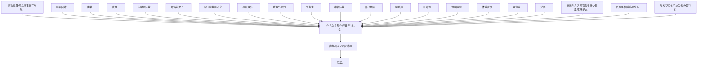

```mermaid
flowchart TD
A[前記毒性の全身性副作用が、]
B[呼吸困難、]
C[咳嗽、]
D[疲労、]
E[心臓の症状、]
F[電解質欠乏、]
G[甲状腺機能不全、]
H[骨量減少、]
I[睡眠の問題、]
J[腎毒性、]
K[神経症状、]
L[自己免疫、]
M[網膜炎、]
N[肝毒性、]
O[胃腸障害、]
P[体重減少、]
Q[倦怠感、]
R[発疹、]
S[感染リスクの増加を伴う白血球減少症、]
T[及び悪性腫瘍の発症、]
U[ならびにそれらの組み合わせ、]
V[からなる群から選択される、]
W[請求項１０に記載の]
X[方法。]

A --> V
B --> V
C --> V
D --> V
E --> V
F --> V
G --> V
H --> V
I --> V
J --> V
K --> V
L --> V
M --> V
N --> V
O --> V
P --> V
Q --> V
R --> V
S --> V
T --> V
U --> V
V --> W
W --> X
```