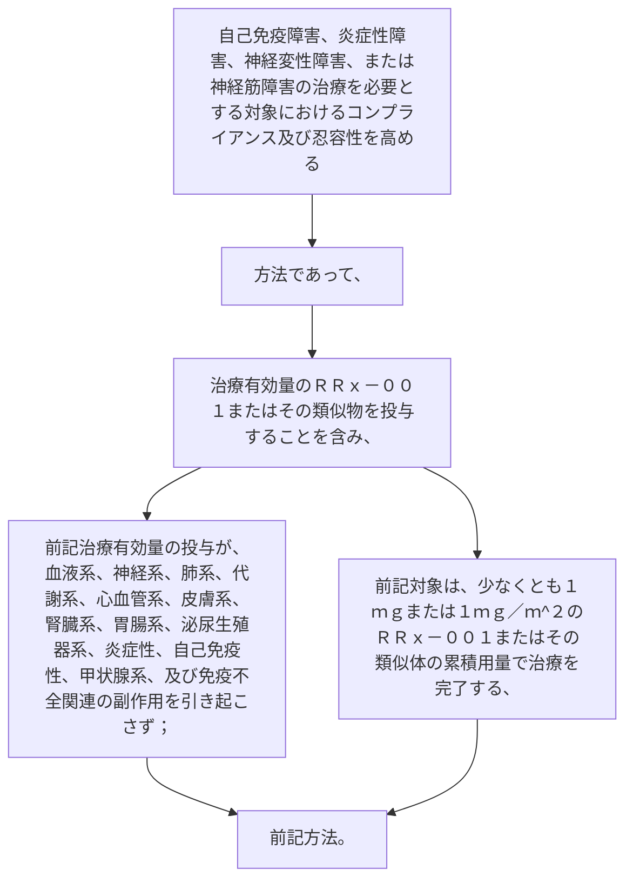

```mermaid
flowchart TD
A[自己免疫障害、炎症性障害、神経変性障害、または神経筋障害の治療を必要とする対象におけるコンプライアンス及び忍容性を高める]
B[方法であって、]
C[治療有効量のＲＲｘ－００１またはその類似物を投与することを含み、]
D[前記治療有効量の投与が、血液系、神経系、肺系、代謝系、心血管系、皮膚系、腎臓系、胃腸系、泌尿生殖器系、炎症性、自己免疫性、甲状腺系、及び免疫不全関連の副作用を引き起こさず；]
E[前記対象は、少なくとも１ｍｇまたは１ｍｇ／ｍ^２のＲＲｘ－００１またはその類似体の累積用量で治療を完了する、]
F[前記方法。]
A --> B
B --> C
C --> D
C --> E
D --> F
E --> F
```