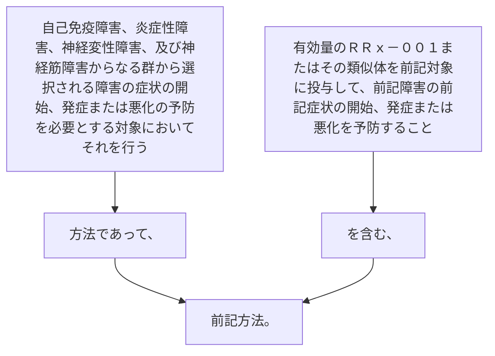

```mermaid
flowchart TD
A[自己免疫障害、炎症性障害、神経変性障害、及び神経筋障害からなる群から選択される障害の症状の開始、発症または悪化の予防を必要とする対象においてそれを行う]
B[方法であって、]
C[有効量のＲＲｘ－００１またはその類似体を前記対象に投与して、前記障害の前記症状の開始、発症または悪化を予防すること]
D[を含む、]
E[前記方法。]
A --> B
C --> D
B --> E
D --> E
```