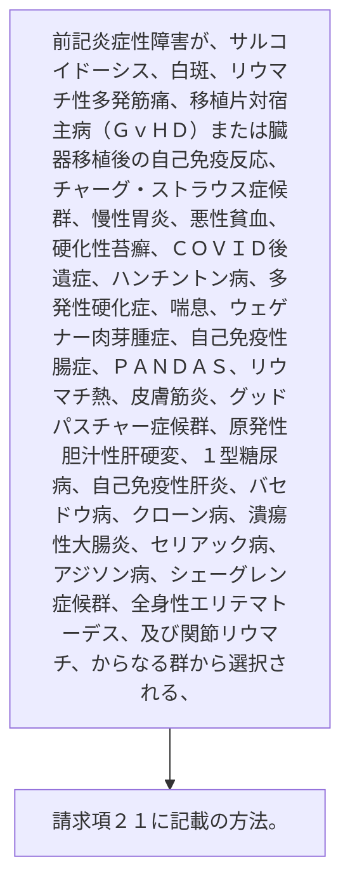

```mermaid
flowchart TD
A[前記炎症性障害が、サルコイドーシス、白斑、リウマチ性多発筋痛、移植片対宿主病（ＧｖＨＤ）または臓器移植後の自己免疫反応、チャーグ・ストラウス症候群、慢性胃炎、悪性貧血、硬化性苔癬、ＣＯＶＩＤ後遺症、ハンチントン病、多発性硬化症、喘息、ウェゲナー肉芽腫症、自己免疫性腸症、ＰＡＮＤＡＳ、リウマチ熱、皮膚筋炎、グッドパスチャー症候群、原発性胆汁性肝硬変、１型糖尿病、自己免疫性肝炎、バセドウ病、クローン病、潰瘍性大腸炎、セリアック病、アジソン病、シェーグレン症候群、全身性エリテマトーデス、及び関節リウマチ、からなる群から選択される、]
B[請求項２１に記載の方法。]
A --> B
```