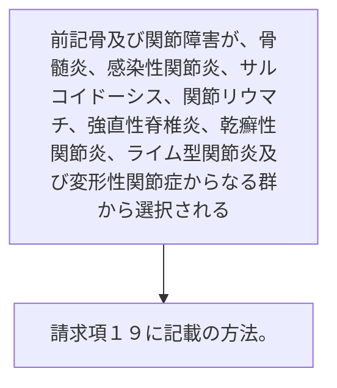

前記骨及び関節障害が、骨髄炎、感染性関節炎、サルコイドーシス、関節リウマチ、強直性脊椎炎、乾癬性関節炎、ライム型関節炎及び変形性関節症からなる群から選択される、請求項１９に記載の方法。

```mermaid
flowchart TD
A[前記骨及び関節障害が、骨髄炎、感染性関節炎、サルコイドーシス、関節リウマチ、強直性脊椎炎、乾癬性関節炎、ライム型関節炎及び変形性関節症からなる群から選択される]
B[請求項１９に記載の方法。]
A --> B
```