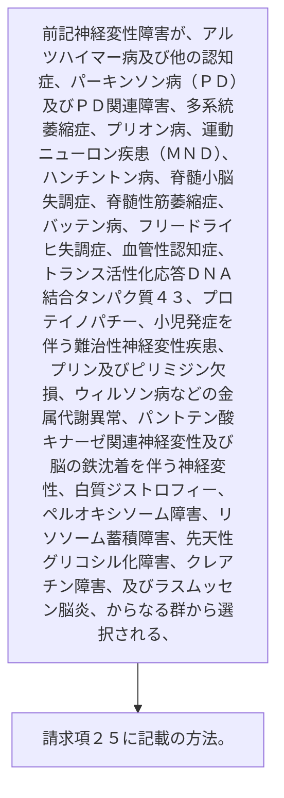

```mermaid
flowchart TD
A[前記神経変性障害が、アルツハイマー病及び他の認知症、パーキンソン病（ＰＤ）及びＰＤ関連障害、多系統萎縮症、プリオン病、運動ニューロン疾患（ＭＮＤ）、ハンチントン病、脊髄小脳失調症、脊髄性筋萎縮症、バッテン病、フリードライヒ失調症、血管性認知症、トランス活性化応答ＤＮＡ結合タンパク質４３、プロテイノパチー、小児発症を伴う難治性神経変性疾患、プリン及びピリミジン欠損、ウィルソン病などの金属代謝異常、パントテン酸キナーゼ関連神経変性及び脳の鉄沈着を伴う神経変性、白質ジストロフィー、ペルオキシソーム障害、リソソーム蓄積障害、先天性グリコシル化障害、クレアチン障害、及びラスムッセン脳炎、からなる群から選択される、]
B[請求項２５に記載の方法。]
A --> B
```