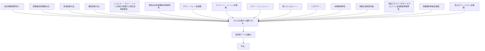

前記神経筋障害が、筋萎縮性側索硬化症、多発性硬化症、重症筋無力症、シャルコー・マリー・トゥース病及び関連する遺伝性神経障害、慢性炎症性脱髄多発神経障害、ギラン・バレー症候群、ランバート・イートン症候群、ミラー・フィッシャー、筋ジストロフィー、ミオパチー、末梢神経障害、神経伝達物質欠損、免疫グロブリンＭガンマグロブリン血症関連神経障害、傍腫瘍性神経症候群、及びスティッフマン症候群、からなる群から選択される、請求項２７に記載の方法。
