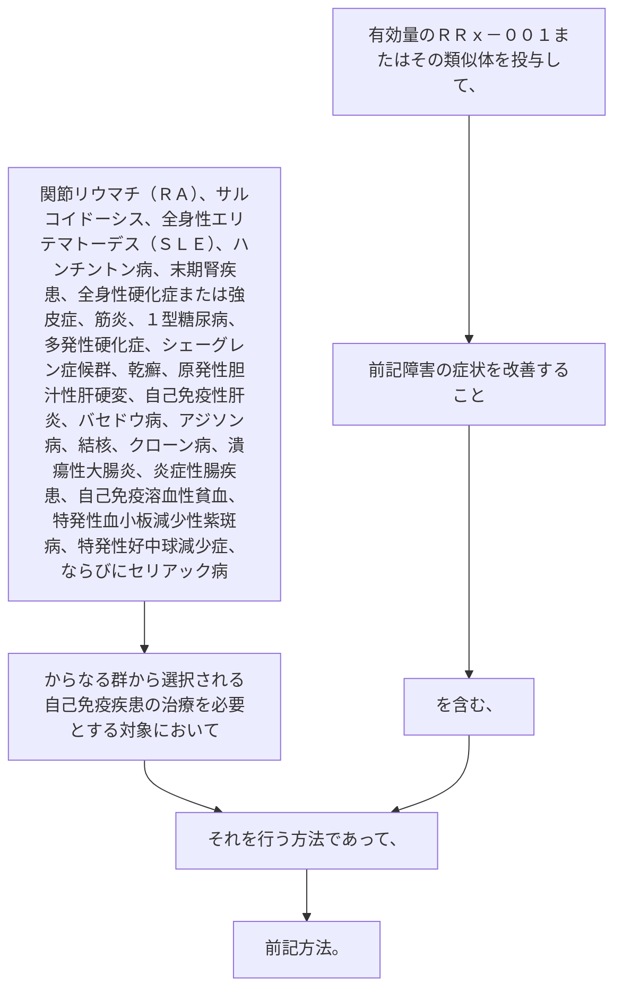

```mermaid
flowchart TD
A[関節リウマチ（ＲＡ）、サルコイドーシス、全身性エリテマトーデス（ＳＬＥ）、ハンチントン病、末期腎疾患、全身性硬化症または強皮症、筋炎、１型糖尿病、多発性硬化症、シェーグレン症候群、乾癬、原発性胆汁性肝硬変、自己免疫性肝炎、バセドウ病、アジソン病、結核、クローン病、潰瘍性大腸炎、炎症性腸疾患、自己免疫溶血性貧血、特発性血小板減少性紫斑病、特発性好中球減少症、ならびにセリアック病]
B[からなる群から選択される自己免疫疾患の治療を必要とする対象において]
C[それを行う方法であって、]
D[有効量のＲＲｘ－００１またはその類似体を投与して、]
E[前記障害の症状を改善すること]
F[を含む、]
G[前記方法。]
A --> B
B --> C
D --> E
E --> F
F --> C
C --> G
```