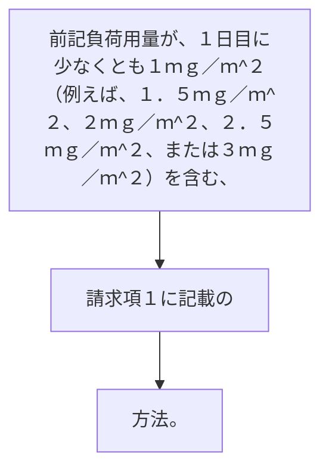

前記負荷用量が、１日目に少なくとも１ｍｇ／ｍ
^２
（例えば、１．５ｍｇ／ｍ
^２
、２ｍｇ／ｍ
^２
、２．５ｍｇ／ｍ
^２
、または３ｍｇ／ｍ
^２
）を含む、請求項１に記載の方法。

```mermaid
flowchart TD
A[前記負荷用量が、１日目に少なくとも１ｍｇ／ｍ^２（例えば、１．５ｍｇ／ｍ^２、２ｍｇ／ｍ^２、２．５ｍｇ／ｍ^２、または３ｍｇ／ｍ^２）を含む、]
B[請求項１に記載の]
C[方法。]
A --> B
B --> C
```