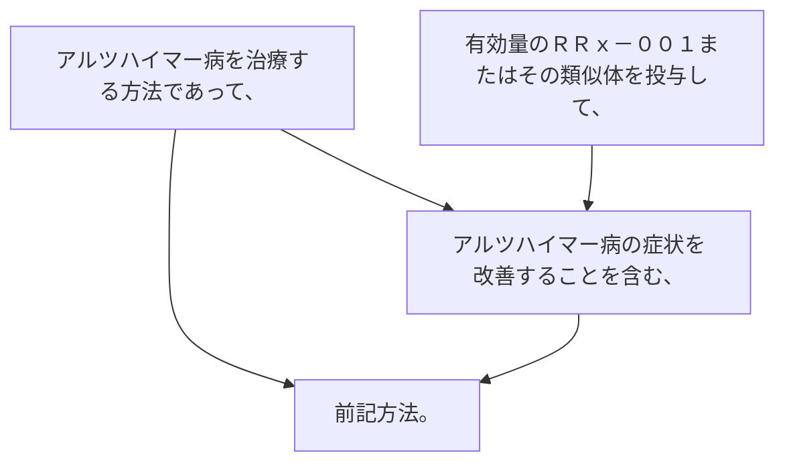

アルツハイマー病を治療する方法であって、有効量のＲＲｘ－００１またはその類似体を投与して、アルツハイマー病の症状を改善することを含む、前記方法。

```mermaid
flowchart TD
A[アルツハイマー病を治療する方法であって、]
B[有効量のＲＲｘ－００１またはその類似体を投与して、]
C[アルツハイマー病の症状を改善することを含む、]
D[前記方法。]
A --> C
A --> D
B --> C
C --> D
```