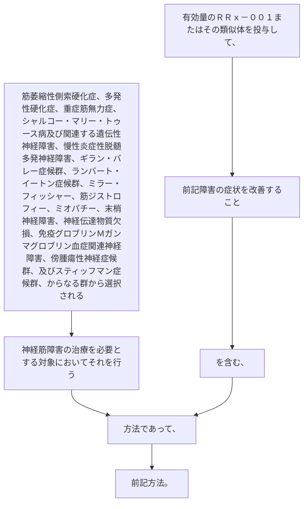

```mermaid
flowchart TD
A[筋萎縮性側索硬化症、多発性硬化症、重症筋無力症、シャルコー・マリー・トゥース病及び関連する遺伝性神経障害、慢性炎症性脱髄多発神経障害、ギラン・バレー症候群、ランバート・イートン症候群、ミラー・フィッシャー、筋ジストロフィー、ミオパチー、末梢神経障害、神経伝達物質欠損、免疫グロブリンＭガンマグロブリン血症関連神経障害、傍腫瘍性神経症候群、及びスティッフマン症候群、からなる群から選択される]
B[神経筋障害の治療を必要とする対象においてそれを行う]
C[方法であって、]
D[有効量のＲＲｘ－００１またはその類似体を投与して、]
E[前記障害の症状を改善すること]
F[を含む、]
G[前記方法。]
A --> B
B --> C
D --> E
E --> F
F --> C
C --> G
```