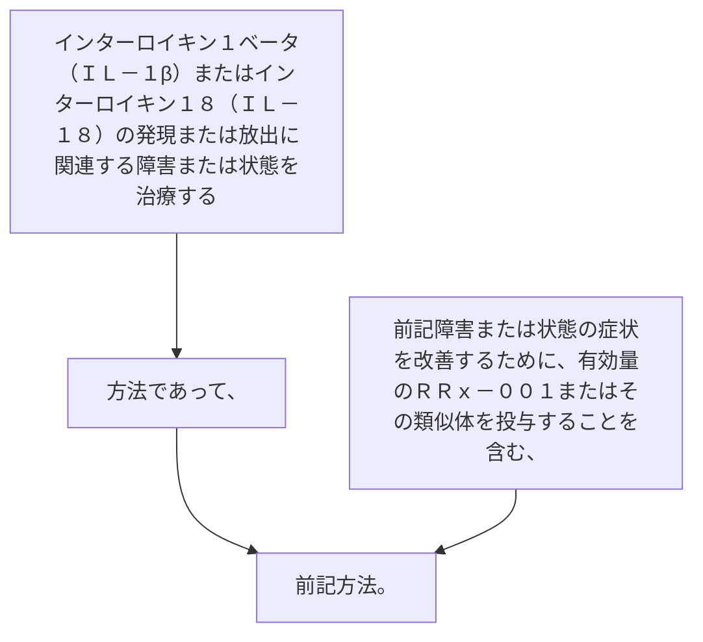

インターロイキン１ベータ（ＩＬ－１β）またはインターロイキン１８（ＩＬ－１８）の発現または放出に関連する障害または状態を治療する方法であって、前記障害または状態の症状を改善するために、有効量のＲＲｘ－００１またはその類似体を投与することを含む、前記方法。

```mermaid
flowchart TD
A[インターロイキン１ベータ（ＩＬ－１β）またはインターロイキン１８（ＩＬ－１８）の発現または放出に関連する障害または状態を治療する]
B[方法であって、]
C[前記障害または状態の症状を改善するために、有効量のＲＲｘ－００１またはその類似体を投与することを含む、]
D[前記方法。]
A --> B
B --> D
C --> D
```