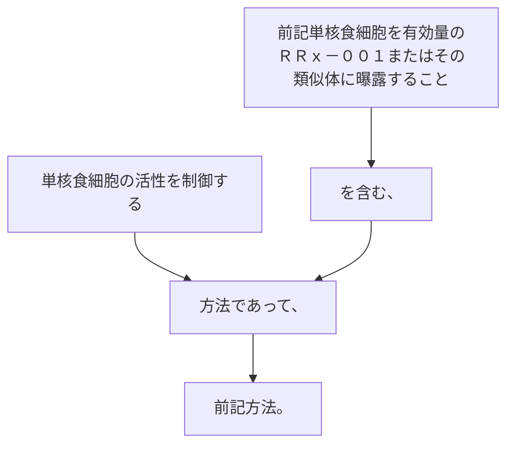

単核食細胞の活性を制御する方法であって、前記単核食細胞を有効量のＲＲｘ－００１またはその類似体に曝露することを含む、前記方法。

```mermaid
flowchart TD
A[単核食細胞の活性を制御する]
B[方法であって、]
C[前記単核食細胞を有効量のＲＲｘ－００１またはその類似体に曝露すること]
D[を含む、]
E[前記方法。]
A --> B
C --> D
D --> B
B --> E
```