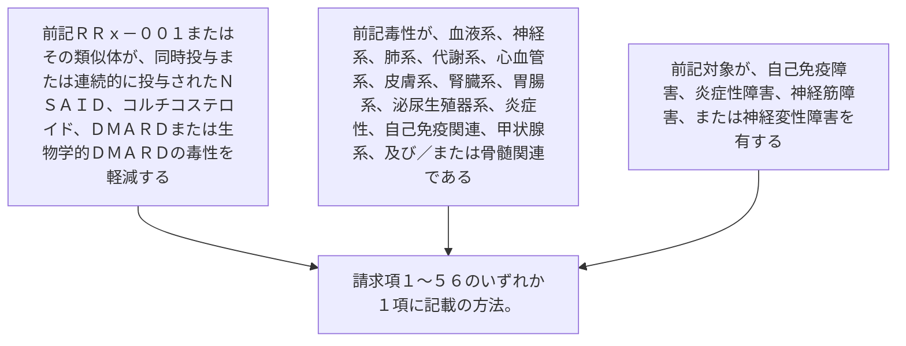

```mermaid
flowchart TD
A[前記ＲＲｘ－００１またはその類似体が、同時投与または連続的に投与されたＮＳＡＩＤ、コルチコステロイド、ＤＭＡＲＤまたは生物学的ＤＭＡＲＤの毒性を軽減する]
B[前記毒性が、血液系、神経系、肺系、代謝系、心血管系、皮膚系、腎臓系、胃腸系、泌尿生殖器系、炎症性、自己免疫関連、甲状腺系、及び／または骨髄関連である]
C[前記対象が、自己免疫障害、炎症性障害、神経筋障害、または神経変性障害を有する]
D[請求項１～５６のいずれか１項に記載の方法。]
A --> D
B --> D
C --> D
```